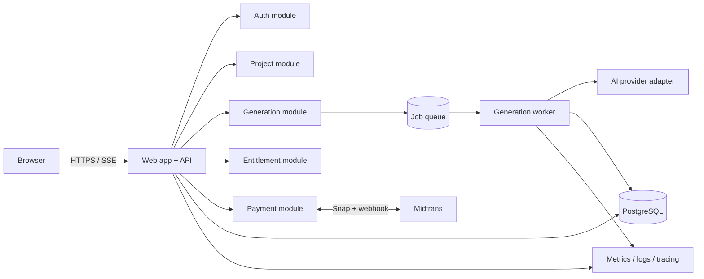
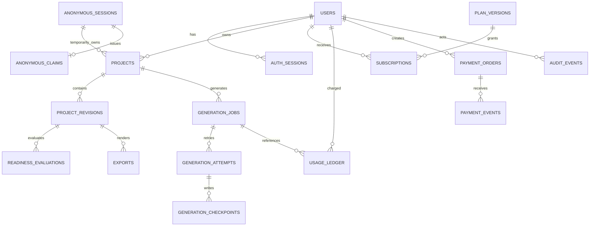
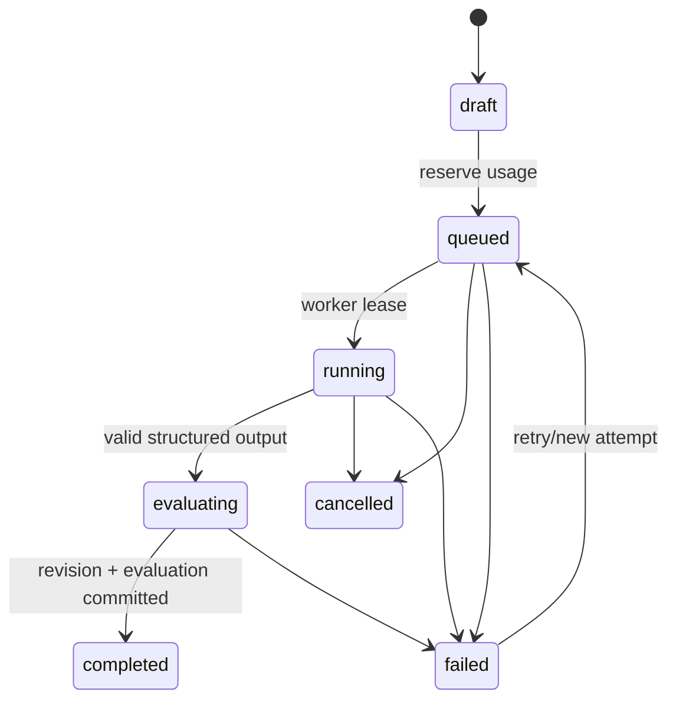

# Technical Design MVP — BikinPRD

| Metadata | Nilai |
|---|---|
| Versi | 0.1 |
| Status | Proposed baseline untuk review engineering |
| Scope | F-01–F-11 / M1 Private MVP |
| Sumber | `PRD.md` v1.0 |

## 1. Tujuan dan batas

Dokumen ini menerjemahkan PRD menjadi kontrak teknis minimum untuk vertical slice: visitor membuat brief, generation menghasilkan PRD, draft diklaim setelah login, diedit, dinilai, diekspor, lalu user dapat membeli Starter. Collaboration, public sharing, agent-specific export, API publik, dan multi-model UI tidak termasuk.

## 2. Keputusan arsitektur

Baseline yang disarankan adalah **modular monolith** agar transaksi ownership, quota, dan payment tetap sederhana. Batas modul wajib jelas sehingga worker dan AI provider dapat dipisah saat beban nyata memerlukannya.

### 2.1 Stack proposed

- TypeScript end-to-end; Next.js untuk web/server routes, PostgreSQL sebagai source of truth.
- Worker process terpisah secara runtime, berbagi domain package dan database; Redis-backed queue direkomendasikan untuk retry, lease, dan delayed jobs.
- Server-sent events untuk progress. Database tetap authoritative saat reconnect.
- Hosted Midtrans Snap; Google OAuth; satu AI provider baseline di balik interface adapter.
- Markdown export dihasilkan on demand dari immutable revision; tidak perlu object storage pada M1.

Stack ini `proposed`, bukan approval vendor. Sebelum scaffold, lakukan spike untuk deployment worker + SSE dan tetapkan provider/model berdasarkan evaluation set dan biaya.

## 3. Modul dan ownership

| Modul | Tanggung jawab | Tidak boleh dilakukan |
|---|---|---|
| Identity | session, OAuth, anonymous token hash, claim | Menentukan entitlement |
| Projects | project, revision, optimistic concurrency, delete/restore | Memanggil provider langsung |
| Generation | job, attempt, checkpoint, provider adapter, evaluation | Mengaktifkan plan |
| Entitlements | plan version, subscription, append-only usage ledger | Mengubah payment state |
| Payments | order, webhook event, reconciliation | Percaya browser callback |
| Exports | render revision + template version | Membaca mutable editor state |
| Operations | redacted lookup, audit, safe retry | Impersonation/edit konten |

Dependency antarmodul menggunakan service interface/domain event internal, bukan akses tabel lintas modul dari handler.

## 4. ERD

### 4.1 Data dictionary dan constraint inti

Semua ID UUID/ULID opaque; semua waktu `timestamptz` UTC. Kolom `created_at` wajib kecuali disebut lain.

| Tabel | Kolom penting | Constraint/index |
|---|---|---|
| `users` | email, display_name, status, deleted_at | unique lower(email); status enum |
| `auth_sessions` | user_id, token_hash, expires_at, revoked_at | unique token_hash; index user_id/expires_at |
| `anonymous_sessions` | token_hash, risk_state, expires_at | unique token_hash; index expires_at |
| `anonymous_claims` | anonymous_session_id, token_hash, consumed_by, consumed_at, expires_at | unique session dan token_hash; single-use transaction |
| `projects` | owner_user_id nullable, anonymous_session_id nullable, title, status, current_revision, deleted_at | exactly one owner before claim, user owner only after claim; index owner/status |
| `project_revisions` | project_id, revision_no, content_json, source, content_hash | unique(project_id, revision_no); immutable |
| `generation_jobs` | project_id, status, idempotency_key, requested_revision, active_attempt, error_code | unique(owner-scope, idempotency_key); status index |
| `generation_attempts` | job_id, attempt_no, provider, model, prompt_version, lease_until, started_at, ended_at, cost_minor | unique(job_id, attempt_no) |
| `generation_checkpoints` | attempt_id, sequence_no, stage, payload_json, schema_version | unique(attempt_id, sequence_no) |
| `readiness_evaluations` | revision_id, rubric_version, prompt_version, score, dimensions_json, hard_gate_json | immutable; revision index |
| `exports` | revision_id, format, template_version, content_hash | revision/created index |
| `plan_versions` | plan_code, version, entitlements_json, price_minor, active_from/to | unique(plan_code, version) |
| `subscriptions` | user_id, plan_version_id, status, period_start/end, source_order_id | one active per user via partial unique index |
| `usage_ledger` | user_id, kind, units, reference_type/id, period_key, reason | unique(kind, reference); append-only |
| `payment_orders` | user_id, order_ref, idempotency_key, amount_minor, currency, status, plan_version_id | unique order_ref dan user/idempotency |
| `payment_events` | order_id, gateway_event_id, payload_hash, valid, effective, received_at | unique gateway_event_id |
| `audit_events` | actor_type/id, action, target_type/id, request_id, metadata_redacted | target/time index; append-only |

Invariant ownership `projects` diterapkan dengan CHECK: tepat satu dari `owner_user_id` dan `anonymous_session_id` terisi untuk project aktif. Claim mengunci claim + project rows, mengisi owner, mengosongkan anonymous owner, dan menandai token consumed dalam satu transaksi.

## 5. State machines

### 5.1 Generation

Hanya worker dapat memindahkan `queued → running → evaluating`. Terminal handler meng-commit atau me-release reservation tepat sekali. Stale lease dapat diambil worker lain tanpa membuat attempt ganda.

### 5.2 Payment

`created → pending → paid`; `created/pending → denied|cancelled|expired`; `paid → refunded|chargeback`. Event lama boleh dicatat tetapi tidak boleh menurunkan state terminal yang lebih authoritative. Entitlement aktif hanya dari transisi efektif ke `paid` setelah signature, nominal, currency, merchant, dan order cocok.

### 5.3 Editor dan claim

- Save membawa `baseRevision`; server hanya membuat `revision + 1` jika sama dengan current revision, selain itu `409 REVISION_CONFLICT`.
- Claim state: `issued → consumed|expired`. Repeated request dengan idempotency key yang sama mengembalikan hasil pertama; token berbeda setelah consumed ditolak.

## 6. API detail

Seluruh response error memakai envelope PRD §12. Request mutation membawa CSRF token untuk cookie auth; create job/order/claim wajib `Idempotency-Key`.

| Endpoint | Request minimum | Response | Error domain utama |
|---|---|---|---|
| `POST /api/v1/anonymous-sessions` | `{}` | `201 {expiresAt}` + cookie | `429 RISK_LIMITED` |
| `POST /api/v1/projects` | `{title, brief, context}` | `201 {project, revision}` | `422 INVALID_BRIEF`, `403 LIMIT_REACHED` |
| `PATCH /api/v1/projects/{id}` | `{baseRevision, patch}` | `{revision, savedAt}` | `409 REVISION_CONFLICT`, `403 FORBIDDEN` |
| `POST .../{id}/generation-jobs` | `{revision}` | `202 {jobId,status}` | `409 JOB_ACTIVE`, `402/403 ENTITLEMENT_REQUIRED` |
| `GET /api/v1/generation-jobs/{id}/events` | `Last-Event-ID` optional | SSE `progress/checkpoint/terminal` | `404 NOT_FOUND` |
| `POST /api/v1/auth/claim` | `{claimToken}` | `{projectId, claimed:true}` | `409 CLAIM_CONSUMED`, `410 CLAIM_EXPIRED` |
| `POST /api/v1/projects/{id}/evaluate` | `{revision}` | `202 {evaluationId}` | `409 REVISION_MISMATCH` |
| `GET .../{id}/exports/markdown?revision=n` | — | UTF-8 attachment | `409 REVISION_NOT_READY` |
| `POST /api/v1/checkout/orders` | `{planCode}` | `201 {orderId,snapToken}` | `409 ORDER_EXISTS`, `422 PLAN_INACTIVE` |
| `POST /api/v1/webhooks/midtrans` | raw gateway body | `204` | `401 INVALID_SIGNATURE`; invalid business data recorded, no effect |

Authorization sengaja mengembalikan `404` untuk object milik user lain. Endpoint list memakai opaque cursor. SSE heartbeat 15 detik; client backoff 1/2/5/10 detik lalu polling.

## 7. AI pipeline dan schema

1. Normalize input tanpa mengeksekusi instruksi di brief.
2. Validate minimum fields, length, secret/PII warning, dan moderation policy.
3. Reserve satu unit usage dan enqueue logical job.
4. Worker membuat prompt dari versioned system template + structured user data.
5. Provider wajib menghasilkan JSON sesuai schema; maksimal satu repair attempt untuk malformed output.
6. Persist checkpoint, buat immutable revision, jalankan readiness evaluator terpisah.
7. Commit revision, evaluation, job terminal state, dan usage ledger secara transactional/outbox-safe.

Canonical output `PrdDocumentV1` berisi `summary`, `problem`, `users[]`, `goals[]`, `nonGoals[]`, `scope`, `requirements[]`, `nfr[]`, `dependencies[]`, `risks[]`, `assumptions[]`, dan `openDecisions[]`. Setiap requirement memiliki `id`, `description`, `priority`, `acceptanceCriteria[]`, `dependencies[]`, `edgeCases[]`, dan `likelyAffectedAreas[]`. Unknown data harus masuk assumption/open decision, bukan nilai rekaan.

Provider adapter mengembalikan `{structuredOutput, provider, model, inputTokens, outputTokens, latencyMs, providerRequestId, finishReason}`. Raw prompt/output tidak masuk application log.

## 8. Failure, consistency, dan recovery

- Transactional outbox digunakan untuk enqueue job dan efek payment agar commit DB tidak terpisah dari publish.
- Worker memakai lease + heartbeat; retry eksponensial berjitter, maksimum tiga attempt untuk error retryable.
- Provider timeout/unavailable me-release quota bila job tidak completed; biaya aktual tetap dicatat internal.
- Disconnect SSE tidak membatalkan job. Client mengambil status authoritative dan checkpoint terakhir.
- Webhook selalu idempotent; reconciliation memeriksa pending >15 menit dan semua mismatch harian.
- Backup harian encrypted, restore drill sebelum M1 gate. Migration harus forward-compatible dan punya rollback plan.

## 9. Security dan retention

Threat model wajib menguji IDOR, CSRF, stored XSS dari AI output, prompt injection, session fixation, claim theft, quota race, webhook replay, dan cross-tenant leakage. Token hanya disimpan sebagai hash. Markdown preview tidak boleh merender HTML mentah. Content anonim: session 24 jam, cleanup maksimal tujuh hari. Account deletion menganonimkan record payment/audit yang wajib dipertahankan dan menghapus content sesuai policy final OD-05.

## 10. Observability dan release checks

Metric minimum: job queue age, transition count, attempt/error code, provider latency/cost, reservation mismatch, claim latency/error, save conflict, webhook lag, payment mismatch, export failures. Semua membawa request/job/order ID tetapi bukan isi brief. Alert P0: kemungkinan cross-user access, ledger invariant rusak, payment paid tanpa entitlement, backup gagal, atau job queue macet.

## 11. Decision log / ADR ringkas

| ADR | Keputusan | Status | Alasan |
|---|---|---|---|
| ADR-001 | Modular monolith + worker terpisah | Proposed | Menjaga transaksi sederhana dan isolasi kerja AI |
| ADR-002 | PostgreSQL source of truth | Proposed | Constraint, transaction, JSON terstruktur, dan audit |
| ADR-003 | Immutable revisions + optimistic concurrency | Accepted dari PRD | Mencegah lost update dan menjaga export reproducible |
| ADR-004 | SSE + status polling fallback | Accepted dari PRD | Progress satu arah dan reconnect sederhana |
| ADR-005 | Append-only usage/payment events | Accepted dari PRD | Audit dan idempotency |
| ADR-006 | No object storage untuk export M1 | Proposed | Export kecil dapat diregenerasi dari revision |

## 12. Blocking sebelum implementation kickoff

- Approve/reject stack proposed dan target deployment.
- Pilih provider/model lewat spike evaluation + cost, bukan preferensi.
- Finalisasi OD-05 retention dan privacy map sebelum menyimpan content user.
- Midtrans/Google sandbox credential tersedia melalui secret manager.
- Buat migrations dan OpenAPI dari kontrak ini; schema aktual menjadi source of truth setelah code ada.
