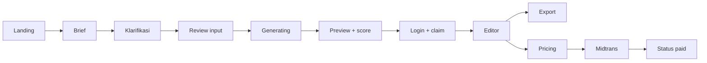

# UX Flow dan Low-Fidelity Wireframes — MVP BikinPRD

## 1. Prinsip

Satu CTA utama: **Buat PRD gratis**. Flow mengutamakan progres, rasa aman bahwa draft tersimpan, dan transparansi atas asumsi AI. Login diminta setelah value terlihat, sebelum edit penuh/export. Semua layar P0 harus bekerja pada 360 px, keyboard-only, dan screen reader.

## 2. Sitemap M1

```text
/
├── /buat
│   ├── /buat/brief
│   ├── /buat/klarifikasi
│   └── /buat/proses
├── /prd/:id
├── /masuk
├── /app
├── /harga
├── /pembayaran/:orderId
├── /syarat
├── /privasi
└── /refund
```

## 3. Happy path



## 4. Wireframes inti

### Landing

```text
┌──────────────────────────────────────────────────────────────┐
│ BikinPRD                         Harga  Masuk                 │
│                                                              │
│ Dari brief client ke spec siap dieksekusi coding agent.      │
│ [ Buat PRD gratis ]  Lihat contoh                            │
│ 1 trial • tanpa kartu • private                              │
│                                                              │
│ Brief berantakan → pertanyaan → PRD + readiness score        │
│ Contoh output | Cara kerja | Harga | FAQ                     │
└──────────────────────────────────────────────────────────────┘
```

### Brief dan klarifikasi

```text
┌──────────────────────────────────────────────────────────────┐
│ Langkah 1 dari 3                              Tersimpan lokal │
│ Ceritakan project atau tempel brief client                   │
│ ┌──────────────────────────────────────────────────────────┐ │
│ │                                                          │ │
│ └──────────────────────────────────────────────────────────┘ │
│ 0/20.000 • Jangan masukkan password/API key                  │
│ [Lanjut]                                                     │
├──────────────────────────────────────────────────────────────┤
│ Langkah 2: maksimal 5 pertanyaan blocking                    │
│ Siapa pengguna utama? [_______________________________]      │
│ ○ Belum tahu — tandai sebagai keputusan terbuka              │
│ [Kembali]                                      [Review input] │
└──────────────────────────────────────────────────────────────┘
```

### Generation dan recovery

```text
┌──────────────────────────────────────────────────────────────┐
│ Menyusun PRD…  3/5                                           │
│ ✓ Memahami masalah   ✓ Menetapkan scope   ● Requirements     │
│ Draft aman tersimpan. Halaman boleh ditinggalkan.            │
│ [Batalkan]                                                   │
│                                                              │
│ Jika koneksi putus: “Menghubungkan kembali…” + [Coba lagi]   │
└──────────────────────────────────────────────────────────────┘
```

### Preview, login gate, dan editor

```text
┌──────────────────────────────────────────────────────────────┐
│ PRD: Marketplace vendor lokal       Readiness 84 / 100       │
│ [Scope] [Requirements] [Risiko]     2 hal perlu ditinjau     │
│ ┌───────────────────────────────┐  ┌───────────────────────┐ │
│ │ Dokumen / editor              │  │ Quality panel         │ │
│ │                               │  │ ✓ Scope               │ │
│ │                               │  │ ! Payment assumption  │ │
│ └───────────────────────────────┘  └───────────────────────┘ │
│ [Masuk untuk edit & export]                                  │
│ Setelah claim: Tersimpan ✓       [Export Markdown]           │
└──────────────────────────────────────────────────────────────┘
```

Mobile menampilkan document dan quality panel sebagai dua tab; CTA save/export sticky tetapi tidak menutupi isi.

## 5. State UX wajib

| Area | State | Perilaku/copy |
|---|---|---|
| Brief | kosong/terlalu pendek | Inline error spesifik; fokus ke field |
| Abuse | challenge | Jelaskan pemeriksaan keamanan; jangan menuduh user |
| Generation | timeout/provider gagal | Draft tetap ada; retry bila retryable; quota tidak hilang |
| Generation | reconnect | Restore dari job ID/status; tidak membuat job baru |
| Claim | expired | Hasil masih tampil jika aman; tawarkan login dan recovery support |
| Claim | consumed | Jika owner sama, arahkan ke project; jika beda, generic conflict |
| Editor | saving/saved/offline/failed | Status selalu terlihat; retry manual tersedia |
| Editor | conflict | Bandingkan versi server dan lokal; tidak overwrite otomatis |
| Score | <80 | Warning + daftar tindakan; export tetap tersedia |
| Payment | pending | Poll/revalidate; user boleh menutup halaman |
| Payment | failed/expired | Jelaskan status dan buat order baru, bukan reuse token |
| Empty app | belum ada PRD | CTA buat PRD + contoh, bukan dashboard kosong |

## 6. Content dan accessibility

- Jangan menyebut output “pasti benar”; gunakan “siap ditinjau” dan tampilkan unresolved decisions.
- Error menyebut apa yang terjadi, apakah data aman, dan tindakan berikutnya.
- Progress tidak mengandalkan warna; gunakan text/status icon dan `aria-live` yang tidak berisik.
- Focus kembali ke heading layar setelah navigasi; modal login menjaga focus dan dapat ditutup.
- Target sentuh minimal 44×44 px, contrast WCAG AA, reduced motion dihormati.

## 7. Prototype usability script M0

Uji lima pengguna ICP dengan brief mereka sendiri. Tugas: mulai tanpa login, pahami pertanyaan, temukan asumsi, claim draft, edit satu requirement, dan export. Ukur completion, waktu, salah klik, pemahaman score, trust, serta bagian yang memerlukan bantuan. Gate: ≥4/5 menyelesaikan tanpa intervensi moderator dan seluruh blocker masuk revisi sebelum high-fidelity design.
